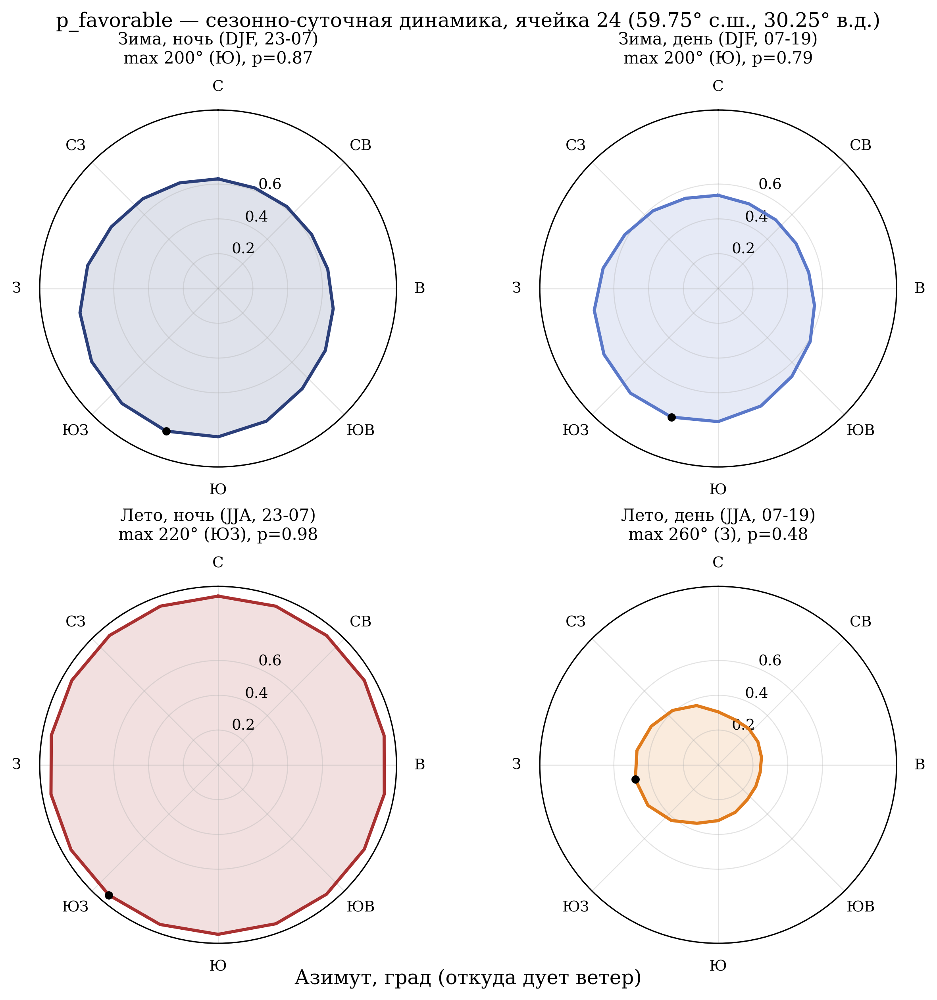
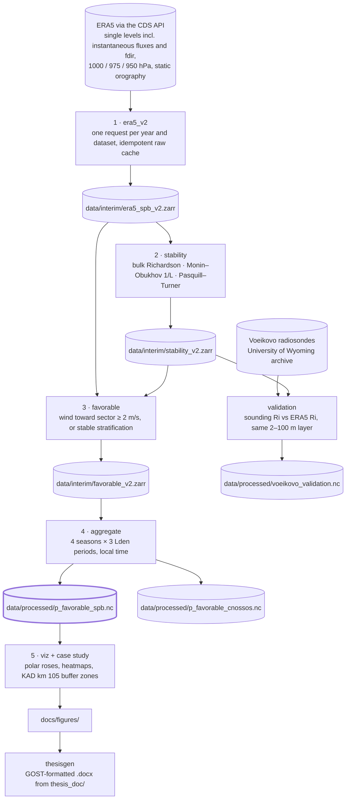

# noise-meteo-spb

**Climatology of meteorological propagation conditions for traffic noise calculation in Saint Petersburg.**

[](https://github.com/meteoFurletov/noise-meteo-spb/actions/workflows/ci.yml)
[](pyproject.toml)
[](LICENSE)
[](https://github.com/astral-sh/ruff)
[](https://github.com/astral-sh/uv)
[](https://doi.org/10.24381/cds.adbb2d47)

<p align="center">
  
</p>
<p align="center"><sub>
Probability of favourable propagation by direction, central city cell (59.75°N, 30.25°E), 2014–2024.
Winter night (top left) is favourable almost everywhere; summer day (bottom right) only downwind of the
prevailing south-westerlies. Labels in Russian; azimuth shown as the direction the wind blows <em>from</em>.
</sub></p>

Hourly [ERA5](https://doi.org/10.1002/qj.3803) reanalysis for 2014–2024 over the Saint Petersburg
metropolitan area is turned into one small lookup table: **the probability that the atmosphere favours
sound propagation, for every grid cell, every 20° azimuth sector, every season and every Lden period
of the day.** That table replaces the single conservative meteorological correction of Russian
normative practice (ГОСТ 31295.2-2005, the national adoption of ISO 9613-2, and СП 276.1325800.2016)
with a directional, seasonal climatology in the spirit of CNOSSOS-EU.

The repository is the computational core of a master's thesis at the Russian State Hydrometeorological
University. The thesis is built from [`thesis_doc/`](thesis_doc/) and the working paper draft is
[`docs/article_draft.md`](docs/article_draft.md), both in Russian.

## Headline results

| Result | Value |
|---|---|
| Domain-mean probability of favourable propagation, 2014–2024 | 68.9 % |
| Same, with the CNOSSOS-EU thermal criterion (Pasquill–Turner classes E–G) | 52.8 % |
| Central city cell, summer: day → night | 34 % → 97 % |
| Central city cell, winter: day → night | 63 % → 73 % |
| Thermal channel, winter night vs summer day | 4.1× |
| Most favourable propagation direction | toward NE (ISO azimuth 40°), i.e. under the prevailing SW winds |
| KAD ring road km 105, mean radius of the 45 dBA contour | 391 m winter night · 306 m summer day · 431 m static worst case |
| Validation against 4 451 Voeikovo radiosonde launches | 68.5 % binary agreement, Cohen's κ = 0.40, Spearman ρ = 0.65 |

Full write-ups: [step 2](docs/step2_v2_report.md), [step 3](docs/step3_v2_report.md),
[step 4](docs/step4_v2_report.md), [CNOSSOS companion](docs/step4g_cnossos_report.md),
[radiosonde validation](docs/voeikovo_validation.md). All figures are in
[`docs/figures/phase_f_v2/`](docs/figures/phase_f_v2/).

## Pipeline



Every step is a package under `src/` with a docstring stating what it reads, what it writes and which
methodological choices it locks in. Intermediate Zarr stores are caches. The NetCDF files under
`data/processed/` are committed, so everything downstream of step 4 runs without ERA5 access.

## The deliverable

`data/processed/p_favorable_spb.nc`, 141 KB, NetCDF-4, CF-1.10. Grid: 5 latitudes × 7 longitudes
(0.25°, 59.5–60.5°N, 29.5–31.0°E), 18 sectors, 4 seasons, 3 periods.

| Variable | Dimensions | Meaning |
|---|---|---|
| `p_favorable` | lat, lon, sector, season, period | favourable by wind **or** by stable stratification (primary) |
| `p_favorable_wind` | lat, lon, sector, season, period | wind criterion alone |
| `p_favorable_thermal_Ri` | lat, lon, season, period | thermal criterion alone, omnidirectional (primary) |
| `p_favorable_thermal_Ri_strict`, `_L_strict`, `_L_moderate`, `_PG` | lat, lon, season, period | thermal sensitivity variants |
| `n_samples` | lat, lon, season, period | hours behind each estimate, 3 972 to 12 144 |

`p_favorable_cnossos.nc` is the companion on the same grid with the CNOSSOS-EU / NMPB-Routes-2008
thermal criterion (Pasquill–Turner E–G) instead of the Richardson cascade, for a like-for-like
comparison with European practice. `n_samples` travels with every probability; a bin without its
sample count is not a result.

```python
import xarray as xr

clim = xr.open_dataset("data/processed/p_favorable_spb.nc")
cell = clim.sel(latitude=59.75, longitude=30.25)              # central city cell
p = cell.p_favorable.sel(season="DJF", period="night")        # 18 values, one per sector
n = cell.n_samples.sel(season="DJF", period="night")
```

## Method in brief

A sector-hour is **favourable** if either condition holds, following ISO 9613-2 / ГОСТ 31295.2 and
CNOSSOS-EU:

1. the 10 m wind component along the propagation direction is at least 2 m/s, or
2. the surface layer is stably stratified, in which case all 18 sectors are favourable for that hour.

Three independent stability classifiers are computed for every hour and cell:

| Classifier | Inputs | Stable when | Role |
|---|---|---|---|
| Bulk Richardson number, 2 m → 100 m | 2 m temperature and dewpoint, 10 m and 100 m wind, temperature at 100 m interpolated in geopotential height between 1000 / 975 / 950 hPa | Ri ≥ 0.1 | primary thermal criterion |
| Monin–Obukhov 1/L | instantaneous surface sensible and latent heat fluxes, turbulent surface stresses | 1/L ≥ 0.05 m⁻¹ | sensitivity variant |
| Pasquill–Turner class | 10 m wind, direct solar radiation by day, cloud cover by night | class E, F or G | fallback when Ri is undefined in calm shear; CNOSSOS companion |

Two conventions worth knowing before reading the code:

- **Sectors point where sound is going.** Stored azimuth is measured clockwise from north toward the
  receiver (ISO 9613-2). The meteorological "wind from" convention used in figures is the opposite
  direction; add 180°.
- **Periods use local time.** ERA5 is UTC. Saint Petersburg is UTC+3 all year, so day 07–19,
  evening 19–23 and night 23–07 are applied as a fixed offset.

## Quick start

Requires Python 3.11+ and [uv](https://docs.astral.sh/uv/).

```bash
git clone https://github.com/meteoFurletov/noise-meteo-spb.git
cd noise-meteo-spb
uv sync            # runtime deps + pytest + ruff
uv run pytest      # 85 tests, offline, a few seconds
```

The lookup tables are committed, so figures and analysis work immediately:

```bash
uv run noise-meteo viz                                  # paper figures into docs/figures/
uv run python scripts/thesis_build.py thesis_doc/       # GOST-formatted thesis .docx
```

**Reproducing from ERA5.** Needs a `~/.cdsapirc` with a Copernicus Climate Data Store key. Raw
downloads are cached per year under `data/raw/` and skipped on rerun, so an interrupted fetch resumes.

```bash
uv run noise-meteo era5_v2 --dry-run                    # print the CDS requests
uv run noise-meteo era5_v2                              # 1. fetch and assemble the cache
uv run python -m src.stability.runner                   # 2. three stability classifiers
uv run python -m src.favorable.runner                   # 3. per-sector favourable flag
uv run python -m src.aggregate.runner                   # 4. primary lookup table
uv run python -m src.aggregate.runner --mode cnossos    #    CNOSSOS-EU companion
uv run noise-meteo soundings                            # radiosonde cache for validation
uv run python -m src.validation.voeikovo_v2             # validation report and figures
```

Every runner accepts `--config` (default [`configs/spb_default.yaml`](configs/spb_default.yaml)),
`--dry-run` and `--force`. All scientific parameters live in that YAML: domain, window, variable
lists, stability thresholds, wind threshold, sector count, Lden hours, case-study geometry.

The earlier ARCO-Zarr based pipeline (single 1000 hPa level, two classifiers) is kept under
`src/*/_v1_archive/` and remains reachable through `noise-meteo fetch / stability / favorable /
aggregate` for comparison. Jupyter for the diagnostic notebooks: `uv sync --group notebooks`.

## Repository layout

```
.
├── configs/spb_default.yaml   # every scientific parameter; nothing is hardcoded in src/
├── src/
│   ├── run.py                 # Typer CLI: era5_v2, soundings, viz, and the archived v1 steps
│   ├── data/                  # step 1: CDS fetch, raw cache, Zarr assembly, radiosonde loader
│   ├── stability/             # step 2: Richardson, Monin–Obukhov, Pasquill–Turner, QC gates
│   ├── favorable/             # step 3: wind and thermal criteria, sector logic
│   ├── aggregate/             # step 4: seasonal/diurnal binning, CNOSSOS combiner, CF NetCDF
│   ├── validation/            # ERA5 Ri vs Voeikovo radiosonde Ri
│   ├── case_study/            # KAD km 105 receiver grid and MGSU propagation model
│   ├── viz/                   # step 5: publication figures
│   ├── exploration/           # station audits and sensitivity comparisons
│   └── thesisgen/             # markdown → GOST 7.32 .docx builder
├── tests/                     # 85 offline tests on synthetic data
├── data/
│   ├── processed/             # p_favorable_spb.nc, p_favorable_cnossos.nc, voeikovo_validation.nc
│   ├── external/              # small static reference data
│   ├── raw/, interim/         # caches (gitignored)
├── docs/
│   ├── figures/phase_f_v2/    # all paper figures (PDF + PNG)
│   ├── *_report.md            # per-step reports with the numbers quoted above
│   └── article_draft.md       # working paper draft (Russian)
├── thesis_doc/                # thesis sources: chapters, figure registry, bibliography
├── notebooks/                 # diagnostics behind the reports
├── scripts/                   # one-off fetch helpers and the thesis build entry point
└── CLAUDE.md                  # orientation for AI-assisted development
```

## Scope

The repository computes the meteorological climatology, validates it, and demonstrates its effect on
one road segment. It is not a full noise-mapping engine: the case study uses a deliberately minimal
propagation model (MGSU 2015 emission table, distance-dependent NMPB-style correction) to show how
buffer zones change, not to certify noise levels. ERA5 at 0.25° resolves coastal versus inland
contrasts across the Gulf of Finland, not street-level effects.

## Development

```bash
uv run pytest
uv run ruff check .
uv run pre-commit install     # optional: lint on every commit
```

CI runs the same two commands on Python 3.11 and 3.12.

## Citation

If you use this code or the climatology, please cite this repository (see
[`CITATION.cff`](CITATION.cff), or the "Cite this repository" button on GitHub) together with the
underlying reanalysis:

> Hersbach, H., Bell, B., Berrisford, P., et al. (2020). The ERA5 global reanalysis.
> *Quarterly Journal of the Royal Meteorological Society*, 146(730), 1999–2049.
> https://doi.org/10.1002/qj.3803

## License

Code is released under the [MIT License](LICENSE). The derived data products under
`data/processed/` and the figures are intended for release under CC BY 4.0 alongside the thesis.
